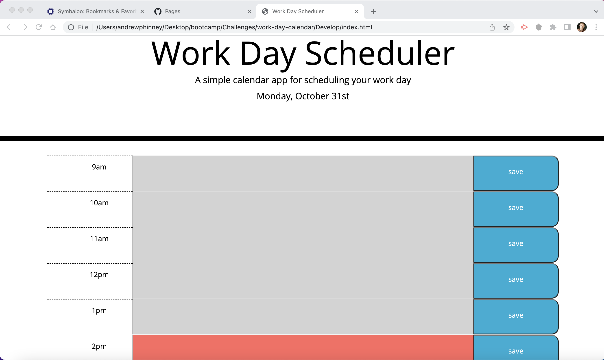
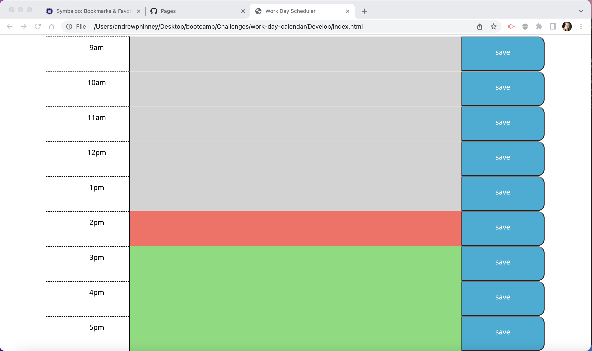
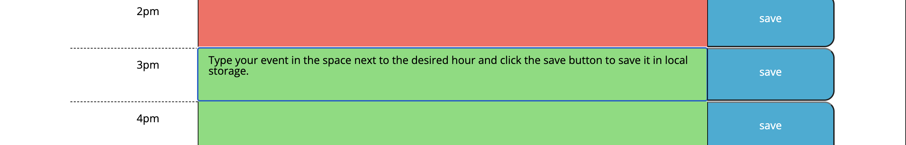

# work-day-calendar

## Description
I wanted to create a simple app that would allow me to plan out my work days. I built this project in hopes that it would help me better understrand moment.js and jquery. It solves the problem of potentially wasting time during the day. I learned that I honestly still have a lot to learn about jquery and moment.js.

## Installation
Use the application via the following website: 
https://aphinney0516.github.io/work-day-calendar/
Upon reaching the website you should see the the daytime work hours(9-5) displayed along with the current date, space for you to write in each hour, and a save button at the end of each row, with past hours displayed using the color gray, the present hour displayed using the color red, and future hours displayed using the color green, as seen in the screenshots below:

Type in the empty space next to the desired hour and click the corresponding save button to save an event to the current work day, as seen in the screenshot below:

## Credits
Since the solution to this project was incidentally provided, I did reference it to help set up my html. My tutor Corey Yates walked me through building the add in javascript using JQuery and moment.js.

